<!-- <div align="center">

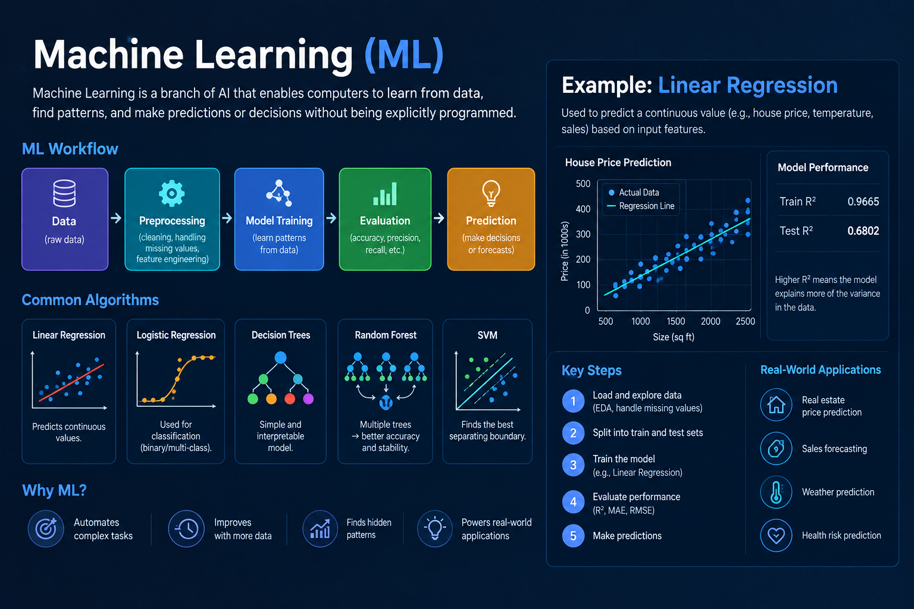
&nbsp;&nbsp;&nbsp;&nbsp;
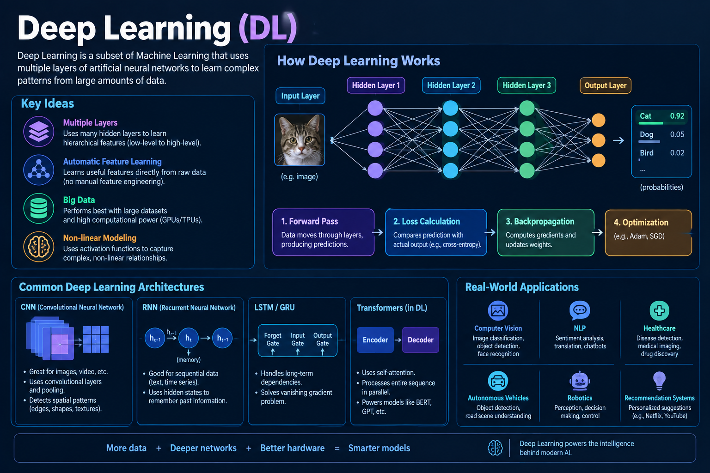
&nbsp;&nbsp;&nbsp;&nbsp;
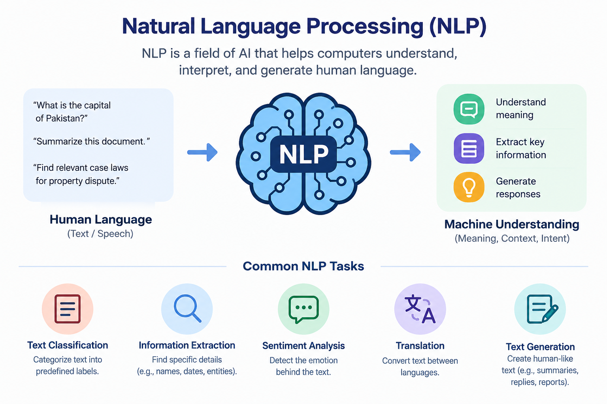
&nbsp;&nbsp;&nbsp;&nbsp;
<!-- 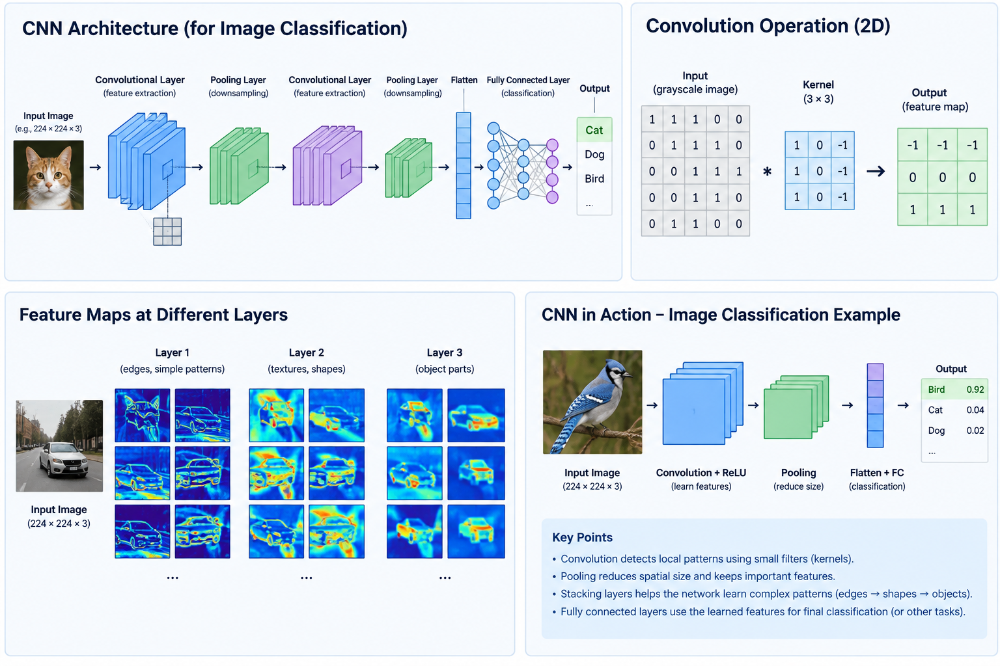 -->
<!-- &nbsp;&nbsp;&nbsp;&nbsp; -->
<!-- 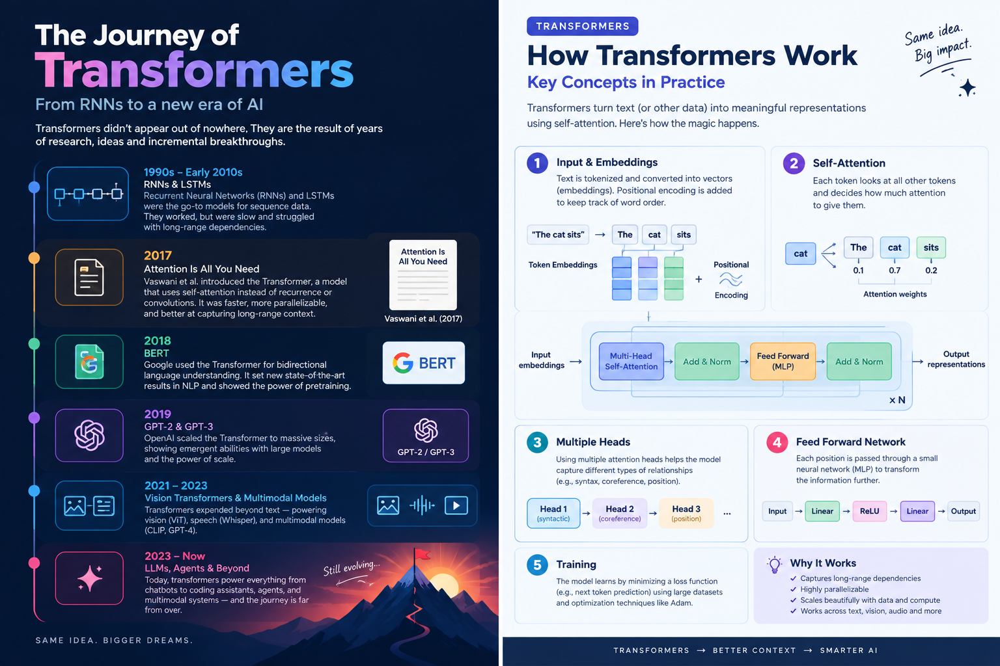 -->

<!-- <br/><br/> -->
<!--  -->
<!-- 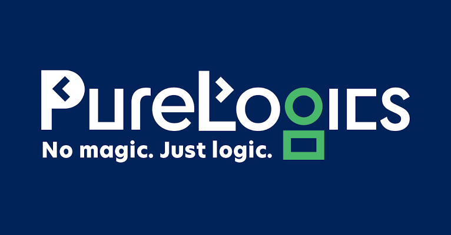 -->

<!-- <br/><br/> -->

<!-- 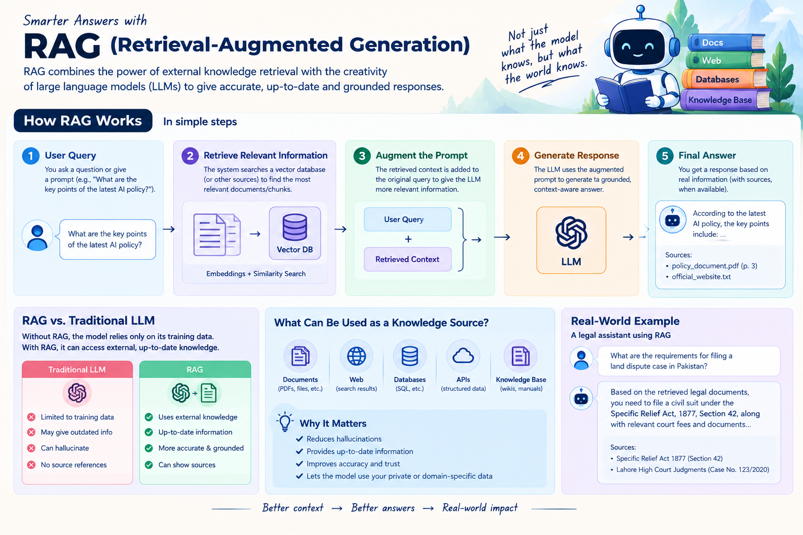
&nbsp;&nbsp;&nbsp;&nbsp;
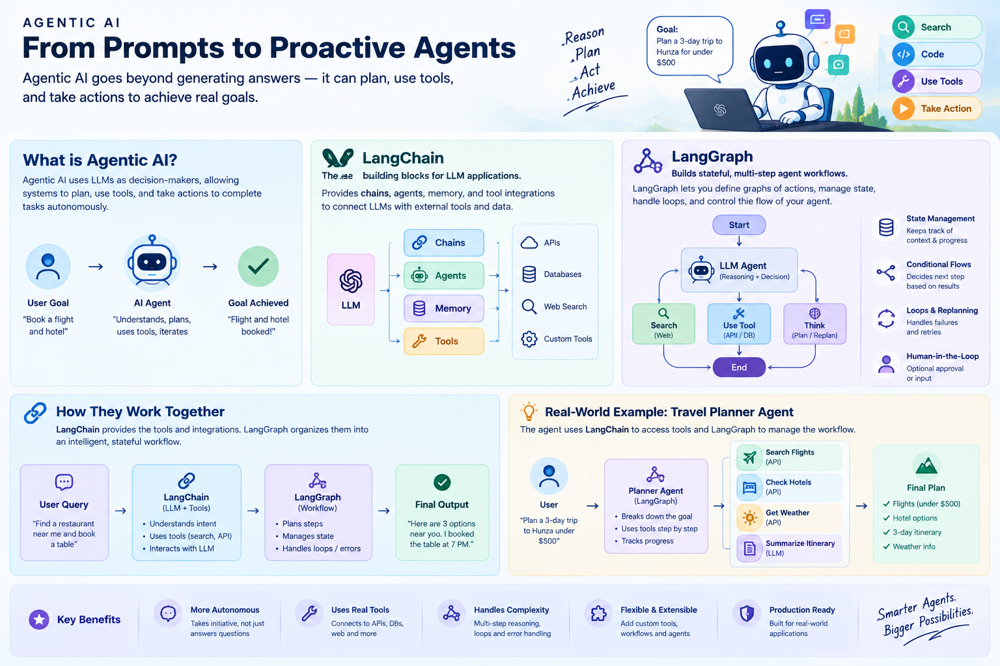
&nbsp;&nbsp;&nbsp;&nbsp;
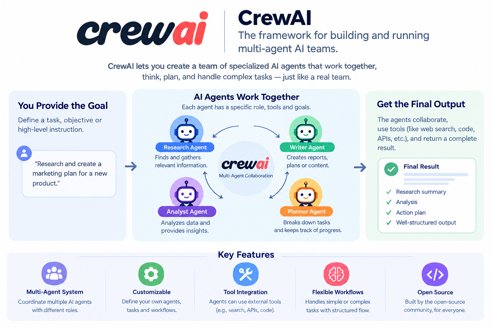
&nbsp;&nbsp;&nbsp;&nbsp;
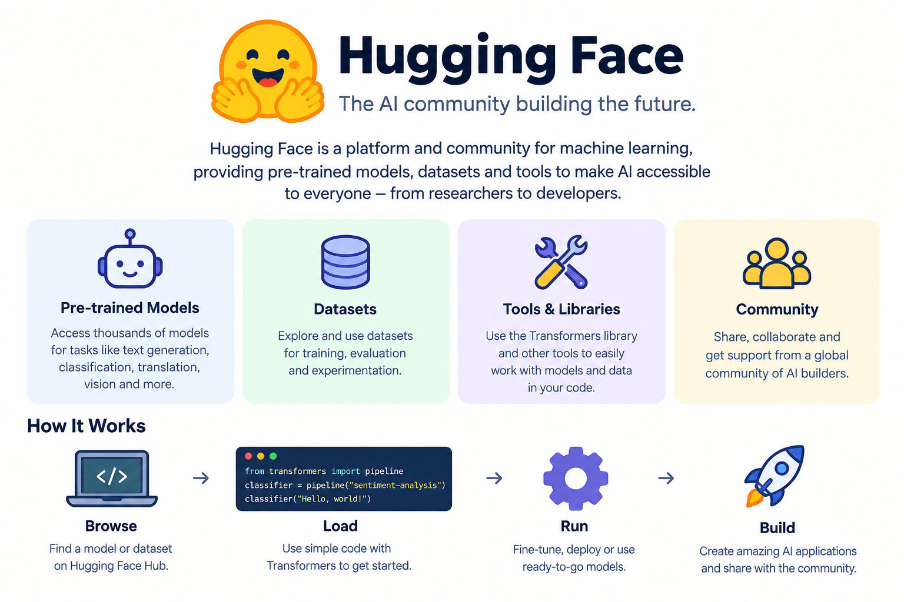
&nbsp;&nbsp;&nbsp;&nbsp;
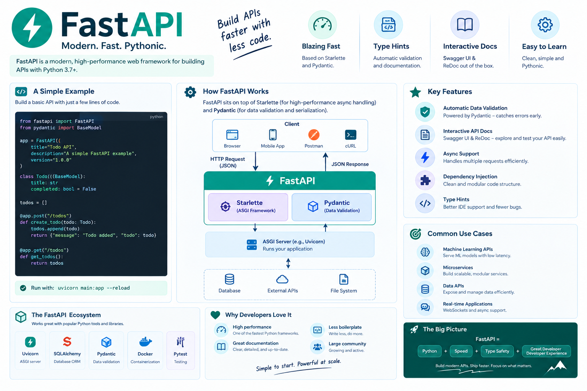

</div> --> -->

<!-- --- -->
<div align="center"> <table border="0" cellspacing="20" cellpadding="0"> <tr> <td align="center"></td> <td align="center"></td> <td align="center"></td> </tr> <tr> <td align="center"></td> <td align="center"></td> <td align="center"></td> </tr> <tr> <td align="center"></td> <td align="center"></td> <td align="center"></td> </tr> <tr> <td align="center" colspan="3">  &nbsp;&nbsp;&nbsp;&nbsp;&nbsp;&nbsp;  </td> </tr> </table> </div>


## 📖 My Journey

Three months ago, I started this journey with nothing more than a curiosity about how machines learn — and a commitment to show up every single day and build. What followed was an intensive, hands-on bootcamp at Purelogics that took me from writing my first lines of Python to designing multi-agent AI systems capable of reasoning, retrieving, and acting autonomously.

Each week brought a new layer of depth: mastering core Python and its libraries, building and training machine learning and deep learning models from scratch, diving into computer vision and natural language processing, and working directly with transformer architectures that power today's most advanced AI. From there, the journey moved into the frontier — fine-tuning large language models, building vision and diffusion-based generative systems, and deploying real applications with Flask and FastAPI.

The final stretch is where things got genuinely exciting: designing Retrieval-Augmented Generation (RAG) pipelines, crafting effective prompts, and building intelligent agents using LangChain, LangGraph, CrewAI, and the Model Context Protocol (MCP) — the tools shaping the next generation of autonomous AI systems.

This repository isn't just a record of assignments. It's a week-by-week trail of real problems solved, real code written under time pressure, and real concepts stress-tested through daily labs — three hours a day, four days a week, no shortcuts. It represents consistency, curiosity, and a genuine love for building with AI.

Beyond the technical curriculum, every Friday was dedicated to soft skills sessions — a space to work on communication, public speaking, and the professional skills that often make the real difference in the industry. Balancing deep technical work with this weekly focus on how to *present* ideas, not just build them, has been just as valuable a part of this journey as the code itself.

I'm sharing this openly because I believe the best way to prove you've learned something is to show your work — messy first drafts, debugging sessions, and all. If you're a recruiter, collaborator, or fellow learner exploring this repo, welcome — I'd love to connect and keep building.

---

## 🗺️ Table of Contents

- [The Journey, Week by Week](#-the-journey-week-by-week)
- [Skills & Technologies](#-skills--technologies)
- [Repository Structure](#-repository-structure)
- [How to Explore This Repo](#-how-to-explore-this-repo)
- [Let's Connect](#-lets-connect)

---

## 🧭 The Journey, Week by Week

<table>
<tr>
<th>Week</th>
<th>Focus</th>
<th>Key Topics</th>
</tr>

<tr>
<td><b><a href="./Week_01_Tasks_Completed">01</a></b></td>
<td>🐍 Python Fundamentals & Data Preprocessing</td>
<td>Core Python, data structures, file handling, cleaning & preparing raw data</td>
</tr>

<tr>
<td><b><a href="./Week_02_Tasks_Completed">02</a></b></td>
<td>📊 Pandas & Building APIs with FastAPI</td>
<td>DataFrames, groupby/merge/pivot, REST APIs, Postman testing</td>
</tr>

<tr>
<td><b><a href="./Week_03_Tasks_Completed">03</a></b></td>
<td>📈 EDA & Foundational Machine Learning</td>
<td>Seaborn/Matplotlib, Titanic dataset, linear regression, classification</td>
</tr>

<tr>
<td><b><a href="./Week_04_Tasks_Completed">04</a></b></td>
<td>🧬 Unsupervised Learning & SVM</td>
<td>SVM, K-Means, PCA, breast cancer dataset, hyperparameter tuning</td>
</tr>

<tr>
<td><b><a href="./Week_05_Tasks_Completed">05</a></b></td>
<td>🧠 Deep Learning Foundations</td>
<td>AutoML, forward/backward pass, TensorFlow, PyTorch, DNNs</td>
</tr>

<tr>
<td><b><a href="./Week_06_Tasks_Completed">06</a></b></td>
<td>👁️ Computer Vision</td>
<td>CNNs, VGGNet, ResNet, YOLOv8 object detection, U-Net segmentation</td>
</tr>

<tr>
<td><b><a href="./Week_07_Tasks_Completed">07</a></b></td>
<td>⚡ Transformers</td>
<td>"Attention Is All You Need", self-attention, positional encoding, Hugging Face</td>
</tr>

<tr>
<td><b><a href="./Week_08_Tasks_Completed">08</a></b></td>
<td>🔗 Prompt Engineering & RAG</td>
<td>Prompt design, LangChain, ChromaDB, vector stores, RAG pipeline</td>
</tr>

<tr>
<td><b><a href="./Week_09_Tasks_Completed">09</a></b></td>
<td>🎨 Generative AI — Vision</td>
<td>Stable Diffusion, image generation workflows</td>
</tr>

<tr>
<td><b><a href="./Week_10_Tasks_Completed">10</a></b></td>
<td>🕸️ Agentic AI</td>
<td>LangGraph, tool/function calling, API integration, error handling</td>
</tr>

</table>

---

## 🛠️ Skills & Technologies

<table>
<tr>
<td valign="top" width="33%">

**Languages & Core**
- Python
- OOP & Data Structures
- File Handling

</td>
<td valign="top" width="33%">

**Data & ML**
- Pandas, NumPy
- Seaborn, Matplotlib
- scikit-learn
- SVM, K-Means, PCA

</td>
<td valign="top" width="33%">

**Deep Learning**
- TensorFlow, PyTorch
- CNNs (VGG, ResNet)
- YOLOv8, U-Net
- Transformers

</td>
</tr>
<tr>
<td valign="top" width="33%">

**Generative AI**
- Prompt Engineering
- Stable Diffusion
- Hugging Face
- LLMs

</td>
<td valign="top" width="33%">

**Agentic AI**
- LangChain
- LangGraph
- Tool/Function Calling
- RAG Pipelines

</td>
<td valign="top" width="33%">

**Backend & Tools**
- FastAPI
- ChromaDB (Vector DB)
- Postman
- Git & GitHub

</td>
</tr>
</table>

---

## 📁 Repository Structure

```
purelogics-ai-genai-bootcamp/
│
├── README.md                          ← you are here
├── .gitignore
│
├── Week_01_Tasks_Completed/           → Python Fundamentals & Data Preprocessing
├── Week_02_Tasks_Completed/           → Pandas & FastAPI
├── Week_03_Tasks_Completed/           → EDA & Foundational ML
├── Week_04_Tasks_Completed/           → SVM, K-Means, PCA
├── Week_05_Tasks_Completed/           → Deep Learning Foundations
├── Week_06_Tasks_Completed/           → Computer Vision
├── Week_07_Tasks_Completed/           → Transformers
├── Week_08_Tasks_Completed/           → Prompt Engineering & RAG
├── Week_09_Tasks_Completed/           → Generative AI (Vision)
└── Week_10_Tasks_Completed/           → Agentic AI (LangGraph)
```

Each week folder contains its own detailed `README.md` explaining the concepts covered, what was built, and the reasoning behind it — along with the original lab notebooks organized by day.

---

## 🔍 How to Explore This Repo

1. Start with this README for the big-picture journey
2. Click into any week above to see that week's dedicated README and lab notebooks
3. Notebooks (`.ipynb`) can be viewed directly on GitHub — code, markdown, and outputs render inline, no download needed

---

## 🤝 Let's Connect

If you're a recruiter, hiring manager, or fellow builder — I'd genuinely love to hear from you.

<div align="center">

[](https://www.linkedin.com/in/zeeshan-ali11/)
[](mailto:zeeshan.work191@gmail.com)
[](https://github.com/z-shan-code)

</div>

<div align="center">
<sub>⭐ If this repo helped you understand what an AI/GenAI bootcamp journey looks like end-to-end, consider giving it a star.</sub>
</div>