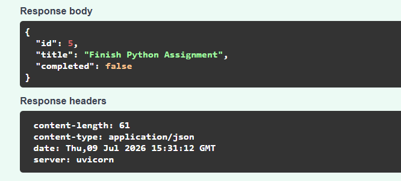
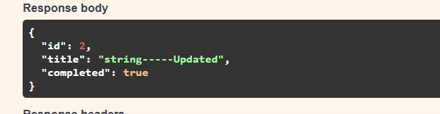
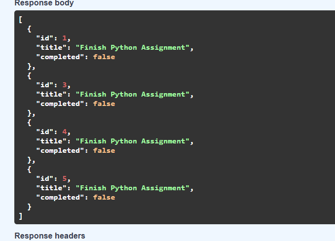
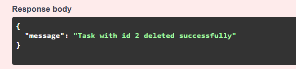

# 📊 Week 2 — Mastering Pandas & Building APIs with FastAPI








> Week 2 marked the shift from "writing Python" to "working with real data" — and by the end of the week, from analyzing data to actually **serving** it through a live API. This is the week the pieces started connecting: clean data in, working software out.

---

## 🗂️ What's Inside

<table>
<tr><td width="140"><b>📅 Day 1–2</b></td><td>Deep dive into <b>Pandas</b> — the core data manipulation library every AI/ML pipeline depends on.</td></tr>
<tr><td><b>📅 Day 4</b></td><td>Built and tested a fully working <b>REST API with FastAPI</b>, validated end-to-end using Postman.</td></tr>
</table>

---

## 🐼 Pandas Deep Dive

Hands-on labs covering the operations that turn messy, real-world data into something a model can actually learn from:

| Notebook | What It Covers |
|---|---|
| `dataframe_basics.ipynb` | Core DataFrame operations — creation, indexing, selection, and inspection |
| `handling_missing_data_replace.ipynb` | Detecting and handling missing values — a critical real-world data cleaning skill |
| `pandas_concat.ipynb` | Combining multiple datasets by stacking them together |
| `pandas_group_by.ipynb` | Aggregating and summarizing data using `groupby` — the backbone of data analysis |
| `pandas_merge.ipynb` | Joining datasets together, similar to SQL joins |
| `pandas_pivot.ipynb` | Reshaping data with pivot tables for cleaner analysis and reporting |
| `pandas_hands_on_practice.ipynb` | Applied practice combining all the above techniques on real datasets |

**Why it matters:** These aren't academic exercises — `groupby`, `merge`, and handling missing data are the exact operations used daily in real data science and ML workflows to prep data before it ever reaches a model.

---

## ⚡ Building a REST API with FastAPI

The second half of the week moved from analyzing data to **serving** it — building a working backend API from scratch.

**What was built:**
- A REST API using **FastAPI**, implementing full CRUD functionality (Create, Read, Update, Delete)
- Endpoints tested live using **Postman**, covering GET, POST, PUT, and DELETE requests — including edge cases like fetching by ID and handling invalid IDs
- Full request/response documentation captured via screenshots for each endpoint

📁 `Fast_API/` — the API source code
📁 `Screenshots_fast_api_assignment/` — Postman testing evidence for every endpoint (GET, POST, PUT, DELETE, and error handling)
📄 `fast_api_assignment.pdf` — write-up of the assignment

**Why it matters:** This is where "data skills" turned into "software engineering skills" — understanding how data actually gets delivered to and consumed by real applications, not just analyzed in a notebook.

---

## 🧠 Key Takeaways
- Comfortable manipulating, cleaning, and reshaping data with Pandas
- Understanding of how to combine and aggregate multiple datasets
- Ability to design, build, and test a working REST API from scratch
- First hands-on experience with API testing tools (Postman) — a staple of real-world backend development

---

## 🛠️ Tech Stack
`Python` · `Pandas` · `Jupyter Notebook` · `FastAPI` · `Postman`

## 📁 Folder Structure
```
Week_02_Tasks_Completed/
├── Week_2_Day_1_Tasks_6_July/      → Pandas fundamentals
├── Week_2_Day_2_Tasks_7_July/      → Pandas applied practice
└── Week_2_Day_4_Tasks_9_July/      → FastAPI build + Postman testing
```